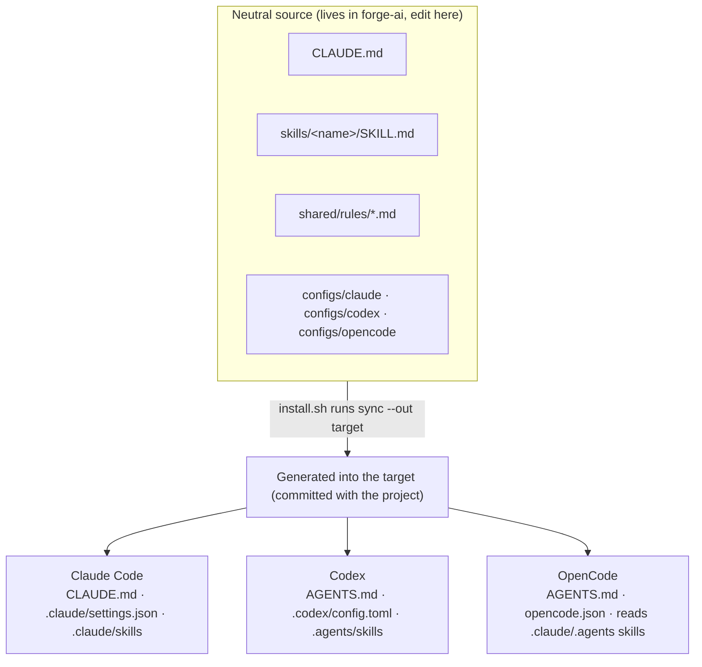
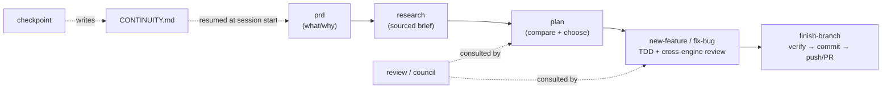

# forge-ai

**One workflow discipline that runs identically on Claude Code, Codex, and OpenCode.**

forge-ai gives an AI coding agent a consistent, opinionated way of working — research →
plan → TDD → cross-engine review → verify → ship — plus shared memory and session
continuity. The discipline is **skills + config only** — no runtime hooks; the only scripts
are the installer and the `sync` generator (both run outside the agent's turn). Point any of
the three CLIs at the project and they pick up the same rules, skills, and guardrails.

---

## What it does

- **Interoperable discipline.** The same workflow works whether you drive with Claude
  Code, Codex, or OpenCode — no per-engine fork to maintain.
- **Guided workflows** for the common cases: new feature, bug fix, quick fix, PRD,
  research, planning, review, multi-engine council, and branch wrap-up.
- **Cross-engine review.** The reviewer/advisor always runs on a *different* engine than
  the driver, so you get real model diversity, not an echo chamber.
- **Portable memory + docs layout.** Solved bugs, decisions (ADRs), plans, and research
  live in the repo so the next session — or the next engine — inherits the context.
- **Session continuity.** A tiny handoff file lets a fresh session (or a reset context)
  resume exactly where you left off.
- **Native ship guardrails.** `git push` / `gh pr create` pause for human approval on
  each engine, using its own native config — no custom scripts.

---

## How it works

### One neutral source, generated per engine (no symlinks)

The shippable payload is a single **engine-neutral source** in **`src/`** — the
instructions, skills, rules, and per-engine configs. This source and its generators live in
the **forge-ai repo**; they never travel into a target project. `install.sh` copies only the
runtime files a target needs and runs a generator (`sync.sh` / `sync.ps1`) that produces each
engine's config and skills **by plain copy** straight into the target — no symlinks, so it
works identically on macOS, Linux, and Windows. Editing is centralized: change the neutral
source in forge-ai, then re-run the installer against the target (**thin install** — the
target gets only what the agent needs at runtime, none of the build machinery).



- **Neutral source vs generated:** you edit only the neutral source in forge-ai (`CLAUDE.md`,
  `skills/`, `shared/rules/`, `configs/`). The per-engine artifacts (`AGENTS.md`,
  `opencode.json`, `.claude/`, `.agents/`, `.codex/`) are **generated into the target and
  committed with it** — so a clone works immediately — but never hand-edited. The target holds
  no source or generator; re-run the installer against it after editing the source.
- **Instructions:** `CLAUDE.md` is the canonical set. Sync copies it to `AGENTS.md` so Claude
  Code reads `CLAUDE.md` and Codex/OpenCode read `AGENTS.md` — same content, no drift.
- **Skills:** `skills/` is the single source of truth. Sync copies it into the two paths that
  cover all three engines: `.claude/skills` (Claude Code, also read by OpenCode) and
  `.agents/skills` (Codex, also read by OpenCode). Codex only discovers project skills under
  `.agents/skills` — not `.codex/skills`.
- **Configs:** `configs/claude/settings.json`, `configs/codex/config.toml`,
  `configs/opencode.json` are the editable gate configs in the forge-ai source. Sync places
  each where its engine looks for it in the target (`.claude/settings.json`,
  `.codex/config.toml`, root `opencode.json`) as a generated baseline. Per-project Claude
  overrides go in `.claude/settings.local.json` (gitignored, never touched by the installer).
- **Rules:** `shared/rules/*.md` hold the discipline (severity, TDD, ship-gates, memory,
  continuity, models, …), read in place and referenced by the skills.

> **Why copies, not symlinks?** Duplication is deliberate: symlinks are fragile on Windows
> and across zip/clone mirrors. One neutral source + a generator gives a single place to
> edit without ever fighting symlink support.

### Enforcement model — honest about what each signal is worth

This is **discipline, not a hard gate.** No hook conditionally blocks an action. Be precise
about the strength of each signal (see [`ship-gates.md`](src/shared/rules/ship-gates.md)):

- **Advisory** — the skills *instruct* the agent to pass the gates before shipping.
- **Attested** — `finish-branch` runs `shared/scripts/check-gates.sh` (`.ps1` on Windows),
  a deterministic Tier-B check that reads `.workflow/state.md` and exits non-zero listing any
  unchecked box. It turns "eyeball the file" into "run a command that fails loudly" — but it
  validates the *record*, not the work (a checked box is a claim), and it only runs when
  invoked.
- **Verified** — the only signal independent of the agent's say-so: run `check-gates.sh` plus
  your tests **in CI with branch protection**, so the check binds to the exact PR commit
  outside the agent's turn. This is the honest place to put a real gate.

On top of that, each engine shows a **best-effort native prompt** on outward actions — it
reads no gate state and matches by command pattern, so it's bypassable:

| Engine | Native prompt | Config |
| --- | --- | --- |
| Claude Code | `git push` / `gh pr create` are `ask`-tier | `.claude/settings.json` |
| Codex | `approval_policy` asks when a command crosses the sandbox boundary | `.codex/config.toml` |
| OpenCode | `git push*` / `gh pr create*` set to `ask` (force-push `deny`) | `opencode.json` |

The prompt is a commit-confirmation, **not** proof the gates are green: the approver must run
`check-gates.sh` or read `.workflow/state.md` first.

**Optional hard block (Claude Code only):** `npx forge-ai --with-hooks` (or
`install.sh --with-hooks`) installs a Claude Code `PreToolUse` hook — the same `check-gates`
behind a hook — that **actually blocks** a ship action when the gates are incomplete. It's
per-developer (written to gitignored `.claude/settings.local.json`), Claude-specific by design
(so it stays opt-in, off the cross-engine default), and fails open. Codex/OpenCode can do the
same (Tier C in [`src/docs/extending.md`](src/docs/extending.md)); no adapter ships yet.

### Repo layout

The payload lives in `src/`, keeping the repo root free of files that would collide when
working ON forge-ai (a root `CLAUDE.md`, `docs/`, etc.). `install.sh` reads `src/` but copies
only the runtime subset into a target; the source, generators, and seed templates stay here:

```
forge-ai/
├── src/                          # ── SOURCE (stays in forge-ai; only runtime is copied) ──
│   ├── CLAUDE.md                 #    canonical instructions (copied to the target)
│   ├── skills/<name>/SKILL.md    #    canonical skills → generated into .claude/ + .agents/
│   ├── shared/rules/*.md         #    discipline: severity, tdd, ship-gates, memory, …
│   ├── shared/scripts/*.{sh,ps1} #    agent-invoked helpers: check-gates, claude-gate-hook (copied)
│   ├── shared/state.template.md  #    workflow-state seed (copied to the target)
│   ├── configs/                  #    gate-config source → generated engine configs (not copied)
│   ├── sync.sh · sync.ps1        #    the generator (never copied into the target)
│   ├── docs/extending.md + empty prds/ plans/ research/ solutions/ adr/  # scaffold
│   └── CONTINUITY.template.md · PROJECT.template.md   # seed-only (never copied)
│
├── VERSION                       # single source of truth for the version (→ .forge-version)
├── bin/forge-ai.mjs              # npx entry point (wraps the installer)   ┐
├── tools/                        # dev-only quality machinery (linter + evals) │ framework only
├── install.sh · install.ps1      # installers (bash + PowerShell)             │ (never copied
└── package.json · README.md · LICENSE   # npm package + docs + license        ┘  into a target)
```

After a **thin install**, a target project holds only runtime files: the managed
`CLAUDE.md`, `shared/rules/`, `shared/scripts/`, `shared/state.template.md`, `.forge-version`;
the project-owned `PROJECT.md`, `CONTINUITY.md`, `docs/`; and the generated engine artifacts —
`AGENTS.md`, `opencode.json`,
`.claude/`, `.agents/`, `.codex/`. Committing the generated layer means a fresh clone of the
project works immediately, with no post-clone step and no dependency on forge-ai. There is no
source or generator in the target — to customize or upgrade, edit the forge-ai source and
re-run the installer against the project. (Only local state — `.workflow/`,
`.claude/settings.local.json` — is gitignored.) Running an upgrade over a project installed
by an older, non-thin version cleans up the leftover machinery automatically (`sync.sh`,
templates, `docs/extending.md` removed; `configs/` and a neutral `skills/` backed up to
`*.pre-forge.bak`).

---

## The workflow



### Skills

| Skill | Purpose |
| --- | --- |
| `prd` | Capture problem/users/goals before designing → `docs/prds/` |
| `research` | Check current docs + prior art, write a sourced brief → `docs/research/` |
| `plan` | Clarify intent, compare approaches, write a reviewed plan → `docs/plans/` |
| `new-feature` | Full feature flow: research → plan → review → TDD → review → verify → ship |
| `fix-bug` | Systematic debugging: reproduce → root cause → failing test → fix → ship |
| `quick-fix` | Trivial changes (<3 files); escalates if scope grows |
| `review` | Cross-engine second opinion on a plan or diff (P0–P3 findings) |
| `simplify` | Post-green, behavior-preserving cleanup pass (tests stay green) |
| `council` | Multi-engine advisors → verdict + minority report (hard, expensive forks) |
| `adr` | Record an architecture decision (context, alternatives, consequences) → `docs/adr/` |
| `finish-branch` | Confirm gates → final verify → commit → push → PR |
| `checkpoint` | Write a clean session handoff to `CONTINUITY.md` before closing |
| `index` | Generate/refresh `docs/index.md` — a high-level project map for fast orientation |

### Memory & continuity

- **Portable memory (repo-first):** durable knowledge lives in the repo — solved bugs in
  `docs/solutions/`, decisions in `docs/adr/`, history in `docs/CHANGELOG.md` — because
  all three engines read it. Personal per-engine memory is used only where it exists.
- **Continuity:** `CONTINUITY.md` holds the current focus, the single **Next step**, and
  blockers. Golden rule #1 tells the agent to read it first every session, so a new
  session or a reset context resumes correctly.

### Models (cross-engine roles)

The reviewer/advisor always runs on a **different engine than the driver** (model diversity is
the point). The concrete **model IDs, effort, and read-only invocation** for each engine live
in **one place** — `src/shared/rules/models.md` — so a CLI or model bump is a single-file
edit; the skills read from there rather than hard-coding commands.

`council` consults all three engines at once; `review`/`research` use the non-driver engine.

---

## Installation

forge-ai is the framework repo — install its discipline into a target project. It's a
**thin install**: only the agent's runtime files land in the target (the generated engine
artifacts + a small managed baseline), so a clone of that project works with no dependency on
forge-ai, while all build machinery stays here. With no target argument the installer uses
the current directory.

### Fastest — `npx` (no clone)

```bash
cd /path/to/your-project
npx forge-ai              # install into the current directory
npx forge-ai --upgrade    # refresh framework files later
npx forge-ai --version    # print the installed forge-ai version
```

The Node wrapper just runs the platform installer bundled in the package (`sh` / `pwsh`); the
content it installs is plain markdown + config, and nothing from npm lands in the target beyond
the same thin payload. Each install stamps `.forge-version` into the target, and a later
`--upgrade` from a different version prints an advisory. _(Publishing to npm is pending name
confirmation; until then use the clone method below.)_

### From a clone

```bash
# macOS / Linux
cd /path/to/your-project && /path/to/forge-ai/install.sh   # install into the current dir
./install.sh /path/to/your-project                         # or name the target explicitly
./install.sh /path/to/your-project --upgrade               # refresh framework files later
```

```powershell
# Windows (PowerShell)
pwsh /path/to/forge-ai/install.ps1                          # install into the current dir
pwsh ./install.ps1 C:\path\to\your-project                  # or name the target explicitly
pwsh ./install.ps1 C:\path\to\your-project -Upgrade         # refresh framework files later
```

What it does:

- **Copies the managed runtime baseline** (overwritten on upgrade): `CLAUDE.md`,
  `shared/state.template.md`, the framework's own entries in `shared/rules/` (refreshed **by
  name**), and the docs scaffolding. Your own rules dropped into `shared/rules/` are left
  untouched, so they **survive upgrades**. The source, generators (`sync.sh`/`sync.ps1`),
  `configs/`, and seed templates are **not** copied — they live only in forge-ai.
- **Creates project-owned files only if missing** (never clobbered on re-run): `PROJECT.md`,
  `CONTINUITY.md`, a seed `docs/CHANGELOG.md`. Per-project Claude overrides go in
  `.claude/settings.local.json` (gitignored, never touched).
- **Generates the engine artifacts** by running `sync --out <target>` (no symlinks):
  `AGENTS.md`, `opencode.json`, and `.claude/`, `.agents/`, `.codex/` (config + skills) as a
  baseline from the forge-ai source. These are **committed with the project** (so clones work
  as-is); to change them, edit the forge-ai source and re-run the installer.
- **Self-heals an older, non-thin install** on upgrade: leftover machinery (`sync.sh`,
  `sync.ps1`, root templates, `docs/extending.md`) is removed, and a pre-existing `configs/`
  or neutral `skills/` is backed up to `*.pre-forge.bak` (never silently deleted).
- An existing `CLAUDE.md` is backed up to `CLAUDE.md.pre-forge.bak` (move its
  project-specifics into `PROJECT.md`), and `.gitignore` is merged, not replaced.
- Runs a **post-install validation** (skill-discovery paths `.claude`/`.agents`, `AGENTS.md`,
  and engine configs generated) that **exits non-zero** if anything is missing, and warns if
  a config lacks the push/PR gate.
- **Checks for git.** The workflow (branches, commits) and the ship gates operate on git. If the
  target isn't a repo, the installer **warns** (it never touches your VCS on its own); pass
  `--git-init` to have it run `git init` + a baseline commit for you.

Then fill in `PROJECT.md` in the target, edit the neutral source in forge-ai as needed
(`skills/`, `configs/`, `CLAUDE.md`) and re-run the installer against the project, and open
the project in any of the three engines.

> **Windows:** no symlinks are used, so nothing special is required — `install.ps1` and
> `sync.ps1` are plain PowerShell copies. (Needs PowerShell 7 / `pwsh`.)

## How to use it

### 1. Open the project in any engine

- **Claude Code** — open the folder; `CLAUDE.md` and `.claude/skills/` load automatically.
- **Codex** — open the folder; `AGENTS.md` and `.agents/skills/` load automatically. Trust
  the project when prompted.
- **OpenCode** — open the folder; `AGENTS.md` and the skills load automatically;
  `opencode.json` applies the push/PR approval gate.

At session start the agent reads `CONTINUITY.md` and resumes from its **Next step**.

### 2. Run a workflow

Skills load **on demand** — there's no special slash syntax (these are `SKILL.md` skills,
not slash-commands). Two ways to trigger one, the same across all three engines:

- **Implicitly** — just describe the task; the engine matches it to a skill's
  `description` and loads it (e.g. "add a feature that …" → `new-feature`; "there's a bug
  where …" → `fix-bug`).
- **Explicitly** — name it: *"use the `new-feature` skill"*, *"run `council` on whether to
  do A or B"*, *"`checkpoint` before I stop"*.

Per engine, if you want to confirm what's available: ask *"what skills do you have in this
project?"* — all three list the `skills/` folder. The skill then walks its phases, writes
artifacts to the right `docs/` folder, and tracks progress in `.workflow/state.md`.

### 3. Ship behind the gate

Before shipping, the workflow checks that the `.workflow/state.md` gates are green
(branch, plan reviewed, tests passing, review clean, verified). `git push` / `gh pr create`
then prompt for approval — approve only when the gates are green.

### 4. Close a session cleanly

Run **`checkpoint`** before you stop (or when context gets tight). It writes a concrete
handoff to `CONTINUITY.md` so the next session — same engine or different — picks up
exactly where you left off.

---

## Project-specific rules

Two rule layers apply, both always-on:

- **Global baseline** (`CLAUDE.md` golden rules + `shared/rules/*`) — the framework
  discipline, applies without exception.
- **Project rules** (`PROJECT.md`) — this project's **Persona**, **Project info**,
  **Variables**, and **Special rules**. Editable per project.

Project rules **add and refine** (tone, context, variables, special behavior); they never
override the safety/ship-gate baseline (on conflict, the baseline wins). All three engines
load `PROJECT.md` via golden rule #2 (OpenCode also force-loads it via `opencode.json`
`instructions`).

**To add project rules:** the installer already seeds `PROJECT.md` in the target — fill the
four sections and commit. No per-engine config needed. See `shared/rules/project-rules.md`.

## Extending

See [`src/docs/extending.md`](src/docs/extending.md) — it defines three tiers (skills-only,
skills + invoked scripts, hooks), a decision checklist, and the steps to add a new skill.
Most new functionality is a single `skills/<name>/SKILL.md` that all three engines
discover automatically.

## Status

**v0.2.0 — quality + distribution.** Verified end-to-end on all three engines — **Claude Code,
Codex, and OpenCode** — driving a real project. Adds a CI-enforced skill linter + routing
evals, anti-rationalization anatomy across every skill, a deterministic `check-gates` ship-gate
validator (with an opt-in Claude Code hard-block via `--with-hooks`), the `adr` and `simplify`
skills, and `.forge-version` + an `npx forge-ai` entry point.

Engines: Claude Code, Codex, OpenCode. 13 skills, 11 rules. Neutral-source + generator model
(no symlinks), **thin install** (only runtime lands in the target; machinery stays in forge-ai)
— cross-platform (`install.sh` + `install.ps1`), validated by dry-run install on both bash and
PowerShell (engine dirs, configs, and `AGENTS.md` generate; bare run targets the cwd; `--upgrade`
preserves project-owned files and rules and self-heals an older non-thin install; bash↔pwsh
parity), and by interactive use of the native push/PR gate in each engine.
