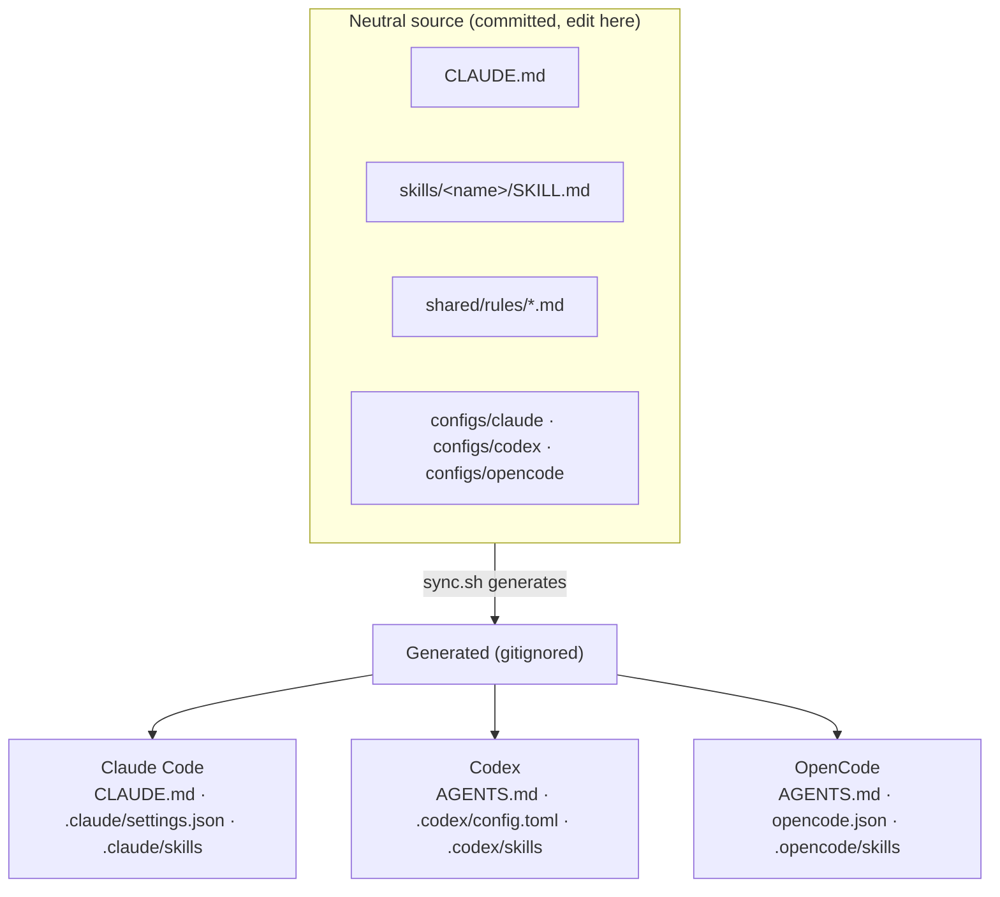
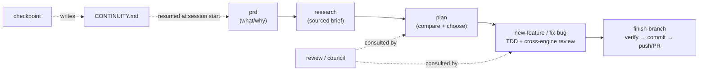

# forge-ai

**One workflow discipline that runs identically on Claude Code, Codex, and OpenCode.**

forge-ai gives an AI coding agent a consistent, opinionated way of working — research →
plan → TDD → cross-engine review → verify → ship — plus shared memory and session
continuity. The discipline is **skills + config only** — no runtime hooks; the only scripts
are the installer and the `sync` generator (both run outside the agent's turn). Point any of
the three CLIs at the project and they pick up the same rules, skills, and guardrails.

---

## What it does

- **Interoperable discipline.** The same workflow works whether you drive with Claude
  Code, Codex, or OpenCode — no per-engine fork to maintain.
- **Guided workflows** for the common cases: new feature, bug fix, quick fix, PRD,
  research, planning, review, multi-engine council, and branch wrap-up.
- **Cross-engine review.** The reviewer/advisor always runs on a *different* engine than
  the driver, so you get real model diversity, not an echo chamber.
- **Portable memory + docs layout.** Solved bugs, decisions (ADRs), plans, and research
  live in the repo so the next session — or the next engine — inherits the context.
- **Session continuity.** A tiny handoff file lets a fresh session (or a reset context)
  resume exactly where you left off.
- **Native ship guardrails.** `git push` / `gh pr create` pause for human approval on
  each engine, using its own native config — no custom scripts.

---

## How it works

### One neutral source, generated per engine (no symlinks)

The shippable payload is a single **engine-neutral source** in **`src/`** — the
instructions, skills, rules, and per-engine configs. `install.sh` copies it into a target
project's root, then a generator (`sync.sh` / `sync.ps1`) produces each engine's config and
skills **by plain copy** — no symlinks, so it works identically on macOS, Linux, and
Windows. Editing is centralized: change the neutral source, re-run sync.



- **Neutral source vs generated:** you edit only the neutral source (`CLAUDE.md`, `skills/`,
  `shared/rules/`, `configs/`). The per-engine artifacts (`AGENTS.md`, `opencode.json`,
  `.claude/`, `.codex/`, `.opencode/`) are **generated and gitignored** — never edited by
  hand, regenerated any time with `./sync.sh` (e.g. after a clone).
- **Instructions:** `CLAUDE.md` is the canonical set. Sync copies it to `AGENTS.md` so Claude
  Code reads `CLAUDE.md` and Codex/OpenCode read `AGENTS.md` — same content, no drift.
- **Skills:** `skills/` is the single source of truth. Sync copies it into each engine's
  discovery path (`.claude/skills`, `.codex/skills`, `.opencode/skills`).
- **Configs:** `configs/claude/settings.json`, `configs/codex/config.toml`,
  `configs/opencode.json` are the editable, project-owned gate configs. Sync places each
  where its engine looks for it (`.claude/settings.json`, `.codex/config.toml`, root
  `opencode.json`).
- **Rules:** `shared/rules/*.md` hold the discipline (severity, TDD, ship-gates, memory,
  continuity, models, …), read in place and referenced by the skills.

> **Why copies, not symlinks?** Duplication is deliberate: symlinks are fragile on Windows
> and across zip/clone mirrors. One neutral source + a generator gives a single place to
> edit without ever fighting symlink support.

### Enforcement model — advisory + native approval

This is **discipline, not a hard gate.** No hook conditionally blocks an action. The
skills *instruct* the agent to pass the gates before shipping (advisory), and each engine
shows a **best-effort native prompt** on outward actions — it reads no gate state and
matches by command pattern (so it's bypassable):

| Engine | Native prompt | Config |
| --- | --- | --- |
| Claude Code | `git push` / `gh pr create` are `ask`-tier | `.claude/settings.json` |
| Codex | `approval_policy` asks when a command crosses the sandbox boundary | `.codex/config.toml` |
| OpenCode | `git push*` / `gh pr create*` set to `ask` (force-push `deny`) | `opencode.json` |

The prompt is a commit-confirmation, not proof the gates are green: **the approver must
check `.workflow/state.md` first.** (Real hard blocking would need per-engine hooks —
Tier C, out of scope; see [`docs/extending.md`](docs/extending.md).)

### Repo layout

The payload lives in `src/`, keeping the repo root free of files that would collide when
working ON forge-ai (a root `CLAUDE.md`, `docs/`, etc.). `install.sh` copies `src/*` into a
target's root; the framework-only files at the root never travel:

```
forge-ai/
├── src/                          # ── PAYLOAD (install.sh copies src/* into a target) ──
│   ├── CLAUDE.md                 #    canonical instructions (neutral source)
│   ├── skills/<name>/SKILL.md    #    canonical skills (one per workflow)
│   ├── shared/rules/*.md         #    discipline: severity, tdd, ship-gates, memory, …
│   ├── configs/                  #    per-engine gate config: claude/ codex/ opencode.json
│   ├── sync.sh · sync.ps1        #    the generator (produces engine dirs from the source)
│   ├── docs/extending.md + empty prds/ plans/ research/ solutions/ adr/  # scaffold
│   └── state.template.md · CONTINUITY.template.md · PROJECT.template.md
│
├── install.sh · install.ps1      # installers (bash + PowerShell)   ┐ framework only
└── README.md · LICENSE           # framework docs + license          ┘ (never copied)
```

After install, a **target** project has (committed) the neutral source at its root —
`CLAUDE.md`, `skills/`, `shared/`, `configs/`, `sync.sh`/`sync.ps1` — plus
`PROJECT.md`/`CONTINUITY.md`. The generated, **gitignored** engine artifacts — `AGENTS.md`,
`opencode.json`, `.claude/`, `.codex/`, `.opencode/` — are produced by `sync` and
regenerated on demand (run it once after a fresh clone).

---

## The workflow



### Skills

| Skill | Purpose |
| --- | --- |
| `prd` | Capture problem/users/goals before designing → `docs/prds/` |
| `research` | Check current docs + prior art, write a sourced brief → `docs/research/` |
| `plan` | Clarify intent, compare approaches, write a reviewed plan → `docs/plans/` |
| `new-feature` | Full feature flow: research → plan → review → TDD → review → verify → ship |
| `fix-bug` | Systematic debugging: reproduce → root cause → failing test → fix → ship |
| `quick-fix` | Trivial changes (<3 files); escalates if scope grows |
| `review` | Cross-engine second opinion on a plan or diff (P0–P3 findings) |
| `council` | Multi-engine advisors → verdict + minority report (hard, expensive forks) |
| `finish-branch` | Confirm gates → final verify → commit → push → PR |
| `checkpoint` | Write a clean session handoff to `CONTINUITY.md` before closing |
| `index` | Generate/refresh `docs/index.md` — a high-level project map for fast orientation |

### Memory & continuity

- **Portable memory (repo-first):** durable knowledge lives in the repo — solved bugs in
  `docs/solutions/`, decisions in `docs/adr/`, history in `docs/CHANGELOG.md` — because
  all three engines read it. Personal per-engine memory is used only where it exists.
- **Continuity:** `CONTINUITY.md` holds the current focus, the single **Next step**, and
  blockers. Golden rule #1 tells the agent to read it first every session, so a new
  session or a reset context resumes correctly.

### Models (cross-engine roles)

Defaults live in `shared/rules/models.md` (edit there to change them). The reviewer/advisor
always runs on a **different engine than the driver**:

| Engine | Model | Effort |
| --- | --- | --- |
| Codex | `gpt-5.6-sol` | `xhigh` |
| Claude | `opus` | `high` |
| OpenCode | `opencode-go/glm-5.2` | default |

`council` consults all three at once; `review`/`research` use the non-driver engine.

---

## Installation

forge-ai is the framework repo — install its discipline into a target project. It's
**copy-based**, so the discipline travels with that repo (works on any clone, no external
dependency). Use the installer for your OS:

```bash
# macOS / Linux
./install.sh /path/to/your-project              # first install
./install.sh /path/to/your-project --upgrade    # refresh framework files later
```

```powershell
# Windows (PowerShell)
pwsh ./install.ps1 C:\path\to\your-project              # first install
pwsh ./install.ps1 C:\path\to\your-project -Upgrade     # refresh framework files later
```

What it does:

- **Copies the managed baseline** (overwritten on upgrade): `CLAUDE.md`, `sync.sh`/`sync.ps1`,
  `docs/extending.md`, the `*.template.md` files, and the docs scaffolding — plus the
  framework's own entries in `skills/` and `shared/rules/`, refreshed **by name**. Your own
  skills/rules dropped into those dirs are left untouched, so they **survive upgrades**.
- **Creates project-owned files only if missing** (never clobbered on re-run): `PROJECT.md`,
  `CONTINUITY.md`, and the neutral configs `configs/claude/settings.json`,
  `configs/codex/config.toml`, `configs/opencode.json`. A pre-existing engine config
  (`.claude/settings.json`, etc.) is **migrated** into `configs/` so its gate isn't lost.
- **Generates the engine artifacts** by running `sync` (no symlinks): `AGENTS.md`,
  `opencode.json`, and `.claude/`, `.codex/`, `.opencode/` (config + skills). These are
  added to `.gitignore` — regenerate them any time with `./sync.sh` (or `sync.ps1`).
- An existing `CLAUDE.md` is backed up to `CLAUDE.md.pre-forge.bak` (move its
  project-specifics into `PROJECT.md`), and `.gitignore` is merged, not replaced.
- Runs a **post-install validation** (all three skill-discovery paths + `AGENTS.md`
  generated) and warns if a config lacks the push/PR gate.

Then fill in `PROJECT.md`, edit the neutral source as needed (`skills/`, `configs/`,
`CLAUDE.md`) and re-run `sync`, and open the project in any of the three engines.

> **Windows:** no symlinks are used, so nothing special is required — `install.ps1` and
> `sync.ps1` are plain PowerShell copies. (Needs PowerShell 7 / `pwsh`.)

## How to use it

### 1. Open the project in any engine

- **Claude Code** — open the folder; `CLAUDE.md` and `.claude/skills/` load automatically.
- **Codex** — open the folder; `AGENTS.md` and `.codex/skills/` load automatically. Trust
  the project when prompted.
- **OpenCode** — open the folder; `AGENTS.md` and the skills load automatically;
  `opencode.json` applies the push/PR approval gate.

At session start the agent reads `CONTINUITY.md` and resumes from its **Next step**.

### 2. Run a workflow

Skills load **on demand** — there's no special slash syntax (these are `SKILL.md` skills,
not slash-commands). Two ways to trigger one, the same across all three engines:

- **Implicitly** — just describe the task; the engine matches it to a skill's
  `description` and loads it (e.g. "add a feature that …" → `new-feature`; "there's a bug
  where …" → `fix-bug`).
- **Explicitly** — name it: *"use the `new-feature` skill"*, *"run `council` on whether to
  do A or B"*, *"`checkpoint` before I stop"*.

Per engine, if you want to confirm what's available: ask *"what skills do you have in this
project?"* — all three list the `skills/` folder. The skill then walks its phases, writes
artifacts to the right `docs/` folder, and tracks progress in `.workflow/state.md`.

### 3. Ship behind the gate

Before shipping, the workflow checks that the `.workflow/state.md` gates are green
(branch, plan reviewed, tests passing, review clean, verified). `git push` / `gh pr create`
then prompt for approval — approve only when the gates are green.

### 4. Close a session cleanly

Run **`checkpoint`** before you stop (or when context gets tight). It writes a concrete
handoff to `CONTINUITY.md` so the next session — same engine or different — picks up
exactly where you left off.

---

## Project-specific rules

Two rule layers apply, both always-on:

- **Global baseline** (`CLAUDE.md` golden rules + `shared/rules/*`) — the framework
  discipline, applies without exception.
- **Project rules** (`PROJECT.md`) — this project's **Persona**, **Project info**,
  **Variables**, and **Special rules**. Editable per project.

Project rules **add and refine** (tone, context, variables, special behavior); they never
override the safety/ship-gate baseline (on conflict, the baseline wins). All three engines
load `PROJECT.md` via golden rule #2 (OpenCode also force-loads it via `opencode.json`
`instructions`).

**To add project rules:** copy `PROJECT.template.md` → `PROJECT.md`, fill the four
sections, commit. No per-engine config needed. See `shared/rules/project-rules.md`.

## Extending

See [`docs/extending.md`](docs/extending.md) — it defines three tiers (skills-only,
skills + invoked scripts, hooks), a decision checklist, and the steps to add a new skill.
Most new functionality is a single `skills/<name>/SKILL.md` that all three engines
discover automatically.

## Status

Engines: Claude Code, Codex, OpenCode. 11 skills, 11 rules. Neutral-source + generator model
(no symlinks) — cross-platform (`install.sh` + `install.ps1`), validated by dry-run install on
both bash and PowerShell (engine dirs, configs, and `AGENTS.md` generate; `--upgrade` preserves
project-owned configs and custom skills; a pre-existing engine config is migrated into `configs/`).
Pending: interactive test of the native push/PR gate in each engine.
