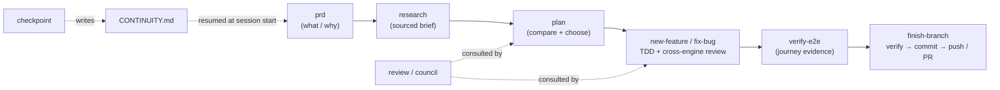
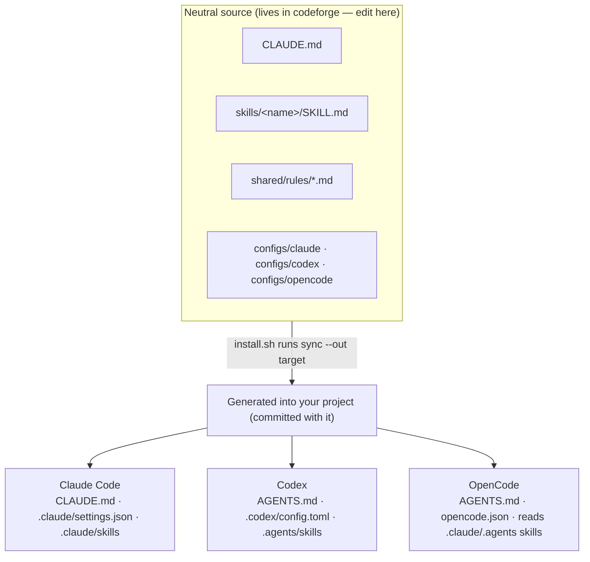

# codeforge

**One AI-coding workflow discipline that runs identically on Claude Code, Codex, and OpenCode.**

codeforge installs a consistent, opinionated way of working into your project — **research →
plan → TDD → cross-engine review → verify → ship** — plus shared memory and session
continuity. Point any of the three CLIs at the project and they pick up the **same** rules,
skills, and guardrails. No per-engine fork to maintain, no echo chamber: the reviewer always
runs on a *different* engine than the driver.

It's **skills + config first** — no runtime hooks by default, no daemon, nothing to keep
running. The install writes plain markdown and config into your repo; a fresh clone works with
zero dependency on codeforge.

```bash
cd /path/to/your-project
npx @jualopezmo/codeforge      # opens an interactive setup wizard
```

---

## Quick start

**1. Install into your project.** In a terminal, this opens a full-screen setup wizard:

```bash
cd /path/to/your-project
npx @jualopezmo/codeforge
```

The wizard (available in **English / Español**) detects which engines you have (you don't need
all three), lets you pick your **default reviewers and council advisors**, a **gate profile**,
and project options, then runs the installer. Prefer no UI? Pass any flag (or run in CI / a
pipe) and it installs non-interactively — the wizard even prints the exact non-interactive
command it would run.

**2. Open the project in any engine.** `CLAUDE.md` / `AGENTS.md` and the skills load
automatically. The agent reads `CONTINUITY.md` and resumes from its **Next step**.

**3. Describe your task.** The engine matches it to the right skill and walks the workflow:

> *"add a feature that lets users export their data as CSV"* → runs `new-feature`
> *"there's a bug where the total is off by one cent"* → runs `fix-bug`
> *"checkpoint before I stop"* → writes a clean handoff to `CONTINUITY.md`

That's it. The rest of this README explains the **workflow**, **how it works** under the hood,
and the full **install** reference.

---

## The workflow

Every task flows through the same disciplined path. Skills load **on demand** — you don't
memorize commands, you describe the task and the engine picks the skill.



1. **Understand** — `prd` captures problem / users / goals; `research` checks current docs and
   prior art and writes a sourced brief.
2. **Plan** — `plan` clarifies intent, compares approaches, and produces a plan that gets a
   **cross-engine review** before any code is written.
3. **Build** — `new-feature` or `fix-bug` drives **TDD** (red → green → refactor) with a
   second review pass on the diff. `quick-fix` handles trivial changes and escalates if scope
   grows.
4. **Verify** — `verify-e2e` runs real user-journey use cases and writes an **evidence report**
   that the ship-gate is bound to (you can't check the box without the report).
5. **Ship** — `finish-branch` confirms the gates are green, runs a final verify, commits, and
   pushes / opens a PR — pausing for your approval at the outward action.
6. **Continue** — `checkpoint` writes a concrete handoff to `CONTINUITY.md` so the next session
   (same engine or a different one) picks up exactly where you left off.

### All skills

| Skill | Purpose |
| --- | --- |
| `prd` | Capture problem / users / goals before designing → `docs/prds/` |
| `research` | Check current docs + prior art, write a sourced brief → `docs/research/` |
| `plan` | Clarify intent, compare approaches, write a reviewed plan → `docs/plans/` |
| `new-feature` | Full feature flow: research → plan → review → TDD → review → verify → ship |
| `fix-bug` | Systematic debugging: reproduce → root cause → failing test → fix → ship |
| `quick-fix` | Trivial changes (<3 files); escalates if scope grows |
| `review` | Cross-engine second opinion on a plan or diff (P0–P3 findings) |
| `simplify` | Post-green, behavior-preserving cleanup pass (tests stay green) |
| `verify-e2e` | Run API/CLI user-journey use cases, write an evidence report, bind the E2E ship-gate to it |
| `council` | Multi-engine advisors → verdict + minority report (hard, expensive forks) |
| `adr` | Record an architecture decision (context, alternatives, consequences) → `docs/adr/` |
| `finish-branch` | Confirm gates → final verify → commit → push → PR |
| `checkpoint` | Write a clean session handoff to `CONTINUITY.md` before closing |
| `index` | Generate/refresh `docs/index.md` — a high-level project map for fast orientation |

**Triggering a skill** (same across all three engines):

- **Implicitly** — just describe the task; the engine matches it to a skill's `description`.
- **Explicitly** — name it: *"use the `new-feature` skill"*, *"run `council` on A vs B"*.
- **Not sure what's available?** Ask *"what skills do you have in this project?"*

---

## How it works

### One neutral source, generated per engine (no symlinks)

You maintain **one** source of truth. codeforge keeps an **engine-neutral source** in `src/`
(instructions, skills, rules, per-engine configs). The installer runs a generator (`sync.sh` /
`sync.ps1`) that produces each engine's config and skills **by plain copy** into your project —
no symlinks, so it behaves identically on macOS, Linux, and Windows.



- **`CLAUDE.md`** is the canonical instruction set; sync copies it to **`AGENTS.md`** so Claude
  Code reads one, Codex/OpenCode read the other — **same content, no drift**.
- **Skills** live once in `skills/` and are copied into the two paths that cover all three
  engines: `.claude/skills` (Claude Code, also read by OpenCode) and `.agents/skills` (Codex,
  also read by OpenCode).
- **Configs** (`.claude/settings.json`, `.codex/config.toml`, `opencode.json`) are generated
  from the source as a baseline; per-project Claude overrides go in the gitignored
  `.claude/settings.local.json`.
- The generated artifacts are **committed with your project**, so a fresh clone works
  immediately — but you never hand-edit them. To customize or upgrade, edit the codeforge
  source and re-run the installer.

> **Why copies, not symlinks?** Symlinks are fragile on Windows and across zip/clone mirrors.
> One source + a generator gives a single place to edit without ever fighting symlink support.

### Thin install

Only the agent's **runtime** files land in your project: the generated engine artifacts plus a
small managed baseline (`CLAUDE.md`, `shared/rules/`, `shared/scripts/`, docs scaffolding).
The build machinery — the neutral source, the generators, the linter, and the evals — **stays
in codeforge and never ships**. So your repo stays lean and has no dependency on codeforge to
run.

### Enforcement model — honest about what each signal is worth

This is **discipline, not a magic hard gate.** codeforge is precise about how much each signal
is worth (see [`ship-gates.md`](src/shared/rules/ship-gates.md)):

- **Advisory** — the skills *instruct* the agent to pass the gates before shipping.
- **Attested** — `finish-branch` runs `shared/scripts/check-gates.sh` (`.ps1` on Windows), a
  deterministic check that reads `.workflow/state.md` and **exits non-zero** listing any
  unchecked box. It validates the *record* (a checked box is a claim), it's **local**, and it
  only runs when invoked.
- **Verified** — the only signal independent of the agent, and the only one that binds for
  every clone and every merge: a shipped **Verified-tier CI template**
  (`docs/ci-templates/gates.yml`) reruns your tests on the PR's merge commit. Copy it into
  `.github/workflows/`, fill in the test step, and make it a **required status check** under
  branch protection — that's the real gate. Repo/org admins can still bypass branch protection
  unless you've configured otherwise.

On top of that, each engine shows a **best-effort native prompt** on outward actions — it
matches by command pattern and reads no gate state, so it's a commit-confirmation, not proof
the gates are green:

| Engine | Native prompt | Config |
| --- | --- | --- |
| Claude Code | `git push` / `gh pr create` are `ask`-tier | `.claude/settings.json` |
| Codex | `approval_policy` asks when a command crosses the sandbox boundary | `.codex/config.toml` |
| OpenCode | `git push*` / `gh pr create*` set to `ask` (force-push `deny`) | `opencode.json` |

**No per-engine runtime hooks.** Local discipline is advisory + `finish-branch`'s
`check-gates` (Attested); the shipped Verified-tier CI template
(`docs/ci-templates/`), made a required check via branch protection, is what actually binds
for everyone.

### Memory & continuity

- **Portable memory (repo-first):** durable knowledge lives in the repo — solved bugs in
  `docs/solutions/`, decisions in `docs/adr/`, history in `docs/CHANGELOG.md` — because all
  three engines read it.
- **Continuity:** `CONTINUITY.md` holds the current focus, the single **Next step**, and
  blockers. The first golden rule tells the agent to read it at session start, so a new session
  or a reset context resumes correctly.

### Models (cross-engine roles)

The reviewer/advisor always runs on a **different engine than the driver** — model diversity is
the whole point. The concrete model IDs, effort, and invocation for each engine live in **one
file**, `src/shared/rules/models.md`, so a CLI or model bump is a single-file edit. `council`
consults all three engines at once; `review`/`research` use the non-driver engine. The wizard
writes your chosen defaults here.

### Execution mode (Claude Code)

During setup you can choose how Claude Code runs the build phase: **inline** (the main session
does the work) or **subagent-driven** (a dedicated implementer subagent, with a model you pick).
The choice is wired into `new-feature`/`fix-bug` via `shared/rules/execution.md`, recorded in
`PROJECT.md`, and materialized as a generated `.claude/agents/codeforge-implementer.md`.

### Repo layout

The payload lives in `src/`, keeping the repo root free of files that would collide when
working ON codeforge. The installer reads `src/` but copies only the runtime subset into a
target:

```
codeforge/
├── src/                          # ── SOURCE (stays in codeforge; only runtime is copied) ──
│   ├── CLAUDE.md                 #    canonical instructions (copied to the target)
│   ├── skills/<name>/SKILL.md    #    14 canonical skills → generated into .claude/ + .agents/
│   ├── shared/rules/*.md         #    12 rules: severity, tdd, ship-gates, execution, memory, …
│   ├── shared/scripts/*.{sh,ps1} #    agent-invoked helper: check-gates (local, Attested tier)
│   ├── shared/state.template.md  #    workflow-state seed (copied to the target)
│   ├── configs/                  #    gate-config source → generated engine configs (not copied)
│   ├── sync.sh · sync.ps1        #    the generator (never copied into the target)
│   └── docs/… · *.template.md    #    docs scaffold + seed-only templates
│
├── cli/                          # interactive setup wizard (Ink/React) ───┐
├── bin/codeforge.mjs             # npx entry point (wraps the installer)   │ framework only
├── tools/                        # dev-only quality machinery (linter+evals)│ (never copied
├── install.sh · install.ps1      # installers (bash + PowerShell)          │  into a target)
├── VERSION                       # single source of truth (→ .forge-version)│
└── package.json · README.md · LICENSE                                      ┘
```

After a thin install, a target holds only: the managed `CLAUDE.md`, `shared/rules/`,
`shared/scripts/`, `shared/state.template.md`, `.forge-version`; the project-owned
`PROJECT.md`, `CONTINUITY.md`, `docs/`; and the generated engine artifacts (`AGENTS.md`,
`opencode.json`, `.claude/`, `.agents/`, `.codex/`). Only local state (`.workflow/`,
`.claude/settings.local.json`) is gitignored. Upgrading a project installed by an older,
non-thin version cleans up the leftover machinery automatically.

---

## Installation

codeforge is the **framework** — you install its discipline into a **target project**. With no
target argument, the installer uses the current directory.

### Fastest — `npx` (no clone)

```bash
cd /path/to/your-project
npx @jualopezmo/codeforge              # interactive wizard (or non-interactive with any flag)
npx @jualopezmo/codeforge --yes        # install with defaults, no wizard
npx @jualopezmo/codeforge --upgrade    # refresh framework files later
npx @jualopezmo/codeforge --version    # print the installed codeforge version
```

The Node wrapper just runs the platform installer bundled in the package (`bash` / `pwsh`); the
content it installs is plain markdown + config. Each install stamps `.forge-version` into the
target, and a later `--upgrade` from a different version prints a drift advisory.

### Interactive setup (default on a TTY)

Run with no arguments in a terminal and codeforge opens a full-screen setup console. Screens, in
order: **splash + language picker (EN/ES)** → **review policy** (default reviewers + council
advisors) → **gate profile** → **project options** → **execution mode** (only if Claude Code is
detected) → **summary**. The summary prints the exact non-interactive command it would run.

Pass any flag, or run without a TTY (e.g. in CI or through a pipe), to skip the UI entirely.

### From a clone

```bash
# macOS / Linux
cd /path/to/your-project && /path/to/codeforge/install.sh   # install into the current dir
./install.sh /path/to/your-project                         # or name the target explicitly
./install.sh /path/to/your-project --upgrade               # refresh framework files later
```

```powershell
# Windows (PowerShell 7 / pwsh)
pwsh /path/to/codeforge/install.ps1                          # install into the current dir
pwsh ./install.ps1 C:\path\to\your-project                  # or name the target explicitly
pwsh ./install.ps1 C:\path\to\your-project -Upgrade         # refresh framework files later
```

### What the installer does

- **Copies the managed runtime baseline** (overwritten on upgrade): `CLAUDE.md`,
  `shared/state.template.md`, the framework's own `shared/rules/` entries (refreshed **by
  name**), and the docs scaffolding. **Your own rules** dropped into `shared/rules/` are left
  untouched, so they survive upgrades.
- **Creates project-owned files only if missing** (never clobbered on re-run): `PROJECT.md`,
  `CONTINUITY.md`, a seed `docs/CHANGELOG.md`.
- **Generates the engine artifacts** by running `sync --out <target>` (no symlinks):
  `AGENTS.md`, `opencode.json`, and `.claude/`, `.agents/`, `.codex/` — committed with the
  project so clones work as-is.
- **Backs up an existing `CLAUDE.md`** to `CLAUDE.md.pre-forge.bak` (move its project-specifics
  into `PROJECT.md`), and **merges** `.gitignore` rather than replacing it.
- **Self-heals an older, non-thin install** on upgrade: leftover machinery is removed; a
  pre-existing `configs/` or neutral `skills/` is backed up to `*.pre-forge.bak`, never silently
  deleted.
- **Runs a post-install validation** that exits non-zero if any skill-discovery path, `AGENTS.md`,
  or engine config is missing, and warns if a config lacks the push/PR gate.
- **Checks for git.** The workflow and gates operate on git; if the target isn't a repo the
  installer **warns** (it never touches your VCS on its own). Pass `--git-init` to have it run
  `git init` + a baseline commit.
- **Auto-isolates Claude Code** from ancestor instructions. Codex and OpenCode scope to the
  project root, but Claude Code walks to the filesystem root and blends every ancestor
  `CLAUDE.md` into your project. So the installer writes `claudeMdExcludes` into the gitignored
  `.claude/settings.local.json` to block those ancestors — making the project run its **own**
  discipline consistently across all three engines. Pass `--no-isolate` to keep inheritance
  (e.g. an intentional monorepo root); a `settings.local.json` you own is never touched.

Then fill in `PROJECT.md` and open the project in any of the three engines.

> **Windows:** no symlinks are used, so nothing special is required — `install.ps1` and
> `sync.ps1` are plain PowerShell copies. Needs PowerShell 7 (`pwsh`).

---

## Project-specific rules

Two rule layers apply, both always-on:

- **Global baseline** (`CLAUDE.md` golden rules + `shared/rules/*`) — the framework discipline,
  applies without exception.
- **Project rules** (`PROJECT.md`) — this project's **Persona**, **Project info**,
  **Variables**, and **Special rules**. Editable per project.

Project rules **add and refine**; they never override the safety/ship-gate baseline (on
conflict, the baseline wins). All three engines load `PROJECT.md` (OpenCode also force-loads it
via `opencode.json` `instructions`). The installer seeds `PROJECT.md` in the target — fill the
four sections and commit. See [`project-rules.md`](src/shared/rules/project-rules.md).

## Extending

See [`src/docs/extending.md`](src/docs/extending.md) — it defines three tiers (skills-only,
skills + invoked scripts, hooks), a decision checklist, and the steps to add a skill. Most new
functionality is a single `skills/<name>/SKILL.md` that all three engines discover
automatically.

## Status

**v0.5.0 — interactive setup + journey-based E2E.** Published to npm as
[`@jualopezmo/codeforge`](https://www.npmjs.com/package/@jualopezmo/codeforge); verified
end-to-end on all three engines — **Claude Code, Codex, and OpenCode** — driving a real project.

This release adds a **full-screen interactive setup wizard** (Ink/React) with English/Español,
configurable **reviewers + council advisors**, a Claude-only **execution mode** (inline vs
subagent-driven), and the **`verify-e2e`** skill whose evidence report is bound to the ship-gate.
It builds on the earlier CI-enforced skill linter + routing evals, anti-rationalization anatomy
across every skill, the deterministic `check-gates` validator, and the `adr` / `simplify`
skills. Enforcement is a shipped **Verified-tier CI template** (`docs/ci-templates/`) made a
required check via branch protection; local discipline is advisory + `finish-branch`'s
`check-gates`; there are no per-engine runtime hooks.

**14 skills, 12 rules.** Neutral-source + generator model (no symlinks), **thin install** (only
runtime lands in the target; machinery stays in codeforge), cross-platform (`install.sh` +
`install.ps1`), CI-validated on Ubuntu **and** Windows.
